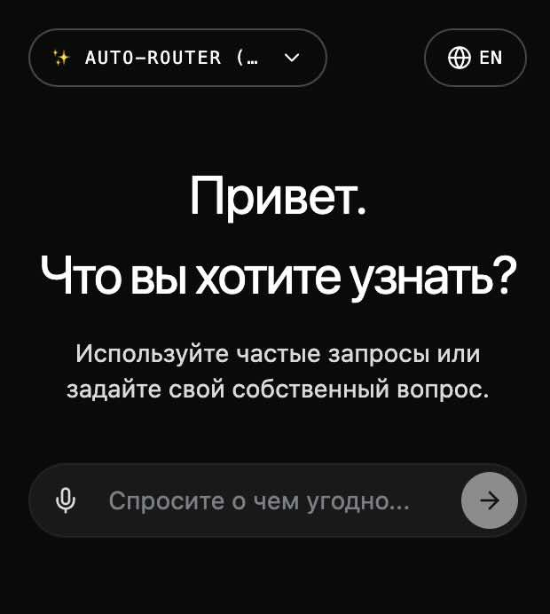
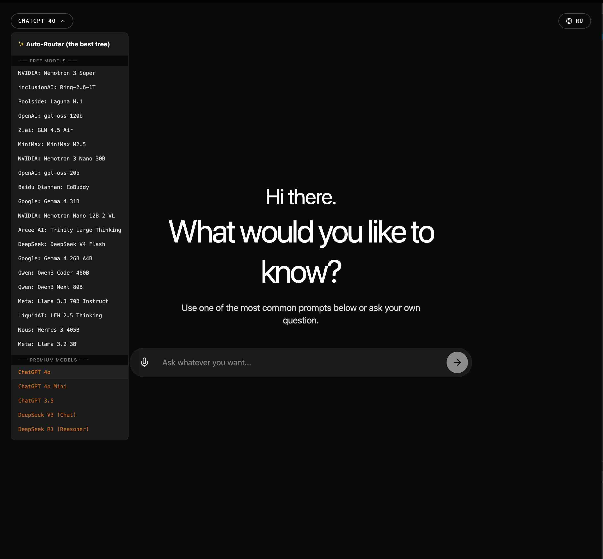

# AI Interface

Минималистичное Fullstack веб-приложение (React + Node.js) для общения с нейросетями. Дизайн вдохновлен строгим стилем xAI. Поддерживает динамический роутинг моделей (OpenAI, DeepSeek, OpenRouter), мультиязычность и голосовой ввод через Web Speech API.

#### mobile/pc
<div align="center">
  
  <br/><br/>
  
</div>

## 📂 Структура проекта

- **`frontend/`** — React-приложение (Vite, Tailwind CSS v4, Lucide Icons).
- **`backend/`** — Node.js сервер (Express, интеграция с официальными API).
- **`makefile`** — Утилита для удобной установки и параллельного запуска проекта.
- **`TZ.md`** — Исходное техническое задание.
- **`LICENSE`** — Лицензия проекта (GPL-3.0).

## 🚀 Быстрый старт

Проект управляется через `make`. Для старта не нужно открывать несколько терминалов.

**1. Установка зависимостей (одной командой для фронта и бэка):**

```bash
make install

```

_(или `npm run install:all` из корня)_

**2. Настройка окружения:**
Создайте файл `.env` в папке `backend/` и добавьте доступные ключи:

```env
PORT=3001
OPENROUTER_API_KEY=sk-or-v1-...
OPENAI_API_KEY=sk-proj-...
DEEPSEEK_API_KEY=sk-...

```

_Бэкенд сам проанализирует ключи и отдаст на фронтенд список только доступных моделей._

**3. Запуск проекта:**

```bash
make dev

```

_(или `npm start` из корня). Скрипт автоматически убьет зависшие порты и поднимет оба сервера параллельно._

## ✨ Особенности

- **Полная адаптивность:** От 320px до 4K.
- **Умный Dropdown:** Группировка моделей (бесплатные/платные), автоматическое скрытие недоступных провайдеров. Расширение списка на весь экран по тройному клику.
- **Voice to Text:** Встроенный голосовой ввод (EN/RU).
- **xAI Design:** Никаких теней, строгая 1px обводка, абсолютный черный фон (`#0a0a0a`) и типографика с отрицательным трекингом.

## 📄 Лицензия

Этот проект лицензирован на условиях [GPL-3.0-or-later](https://www.google.com/search?q=./LICENSE).
